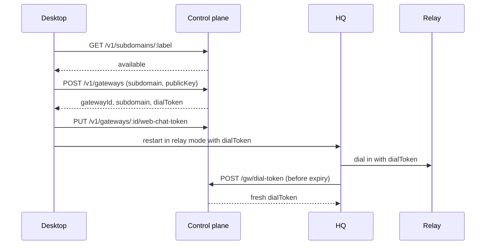
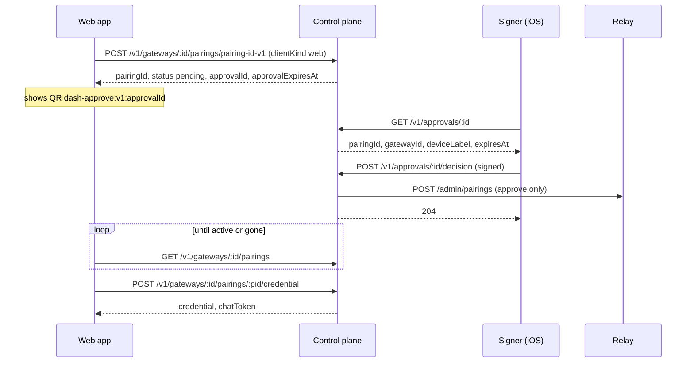

The relay control plane is the account-facing service behind [Remote Access](/remote-access). It
owns the record of which organization owns which HQ, mints the signed dial tokens an HQ uses to
connect out to the relay, and provisions (and revokes) the per-device credentials phones and
browsers present to the relay. It is the only service that calls the relay's administrative API,
so no client ever holds the relay's master secret.

This page covers the control plane only. The relay itself — the tunnel your HQ dials into and the
routes devices use to reach it — is documented in the [Relay API](/api-relay).

## Base URL

The control plane is a standalone HTTP service. Every client is configured with its base URL
(scheme and host, no path) and appends the paths on this page to it:

| Client | Where the base URL comes from |
|--------|-------------------------------|
| Desktop (Mission Control) | Its control-plane setting, used after you sign in under **Remote access** |
| DashSquad for iOS | The `DashControlPlaneURL` value built into the app |
| DashSquad web | The `VITE_CONTROL_PLANE_URL` build setting |
| HQ | The `--control-plane-url` flag |

A self-hosted control plane listens on port `9400` by default. See [Configuration](#configuration).

## Authentication

The control plane has three authentication schemes, one per route group.

| Routes | Scheme | Header |
|--------|--------|--------|
| `GET /health` | None | — |
| Every `/v1/*` route | DashSquad account sign-in (Clerk OIDC ID token) | `Authorization: Bearer <id-token>` |
| `POST /gw/dial-token` | HQ-signed key-possession assertion | `Authorization: Bearer <assertion>` |

### Account bearer (`/v1/*`)

Every `/v1/*` request must carry the ID token from your DashSquad sign-in:

```text
Authorization: Bearer <your-id-token>
```

The control plane verifies the token's signature against the sign-in provider's published keys,
and checks that its issuer and audience match the configured sign-in application. It then reads
the token's **organization** (`org_id`) and uses it as the account that owns everything you
create. A token without an organization is rejected; there is no fallback to the individual
user. This is why [Remote Access](/remote-access#set-it-up) asks you to pick an organization when
you sign in.

A missing, malformed, expired, or organization-less token gets:

```json
{ "error": "unauthorized" }
```

with status `401`.

Every `/v1/*` route is scoped to that account. Asking about an HQ, pairing, or approval that
belongs to another account returns `404`, exactly as if it did not exist — the control plane never
confirms that someone else's resource exists.

<Note>
A development build can instead trust an `x-test-account` header as the account ID. The server
enables this only when it is explicitly started with `RELAY_CP_DEV_STUB_AUTH=1` or
`NODE_ENV=development`, and never while sign-in credentials are configured. Never enable it on a
reachable server.
</Note>

### HQ assertion (`/gw/dial-token`)

An HQ does not sign in to an account. It proves it holds the Ed25519 private key whose public key
was registered when the HQ was enrolled, by sending a short-lived signed assertion:

```text
Authorization: Bearer <base64url(claims)>.<base64url(signature)>
```

The claims segment is JSON:

| Claim | Type | Description |
|-------|------|-------------|
| `gatewayId` | `string` | The HQ's ID (its address label) |
| `aud` | `string` | Must be exactly `cp-dial-token` |
| `iat` | `number` | Issued-at, unix seconds |
| `exp` | `number` | Expiry, unix seconds; the assertion is rejected once `exp` is not in the future |

The signature is Ed25519 over the base64url claims segment. There is no algorithm field. The
`cp-dial-token` audience keeps an assertion made for the control plane from being replayed at
the relay, whose dial-in proof uses a different audience. DashSquad's HQ signs a fresh assertion
for every request, valid for 60 seconds.

### Timestamps

Every timestamp in `/v1/*` responses — `createdAt`, `expiresAt`, `approvalExpiresAt` — is **unix
milliseconds**. The claims inside dial tokens and HQ assertions use **unix seconds**.

### Errors

Errors are JSON objects with a single `error` string, for example
`{ "error": "HQ not found" }`. The one exception is the credential-claim route's
"not decided yet" answer, which is `{ "status": "pending" }` (see
[Claim an approved credential](#post-%2Fv1%2Fgateways%2F%7Bid%7D%2Fpairings%2F%7Bpid%7D%2Fcredential)).
An unexpected server-side failure, such as the relay's administrative API being unreachable
during a revoke, surfaces as a `500`.

## Route index

| Method | Path | Auth | Called by |
|--------|------|------|-----------|
| `GET` | `/health` | None | Desktop |
| `POST` | `/gw/dial-token` | HQ assertion | HQ |
| `POST` | `/v1/gateways` | Account | Desktop |
| `GET` | `/v1/gateways` | Account | Desktop, iOS, web |
| `GET` | `/v1/subdomains/:label` | Account | Desktop |
| `PUT` | `/v1/gateways/:id/web-chat-token` | Account | Desktop |
| `DELETE` | `/v1/gateways/:id` | Account | — |
| `POST` | `/v1/gateways/:id/pairings/pairing-id-v1` | Account | Desktop, iOS, web |
| `POST` | `/v1/gateways/:id/pairings` | Account | Older Desktop releases |
| `GET` | `/v1/gateways/:id/pairings` | Account | Desktop, web |
| `DELETE` | `/v1/gateways/:id/pairings/:pid` | Account | Desktop, iOS, web |
| `POST` | `/v1/gateways/:id/pairings/:pid/credential` | Account | Web |
| `POST` | `/v1/signers` | Account | iOS |
| `GET` | `/v1/signers` | Account | — |
| `GET` | `/v1/approvals/:id` | Account | iOS |
| `POST` | `/v1/approvals/:id/decision` | Account | iOS |

DashSquad for Android never calls the control plane. It receives its relay address and device
credential from the QR code Desktop shows, which Desktop minted through the pairing route.

## Concepts

**HQ (gateway).** An enrolled HQ is identified by the address label you chose, which is also its
permanent `gatewayId`. Its public relay address is `<label>.<relay zone>`. Paths and fields keep
the older `gateway` name. An HQ record is `active` until it is deleted, after which it stays in the
list as `revoked` forever; the label is never released.

**Dial token.** A control-plane-signed token the HQ presents to the relay when it connects out. It
names the owning account (`tenantId`), the `gatewayId`, an expiry, and the HQ's public key
(`cnf`), so only the holder of the matching private key can use it. Tokens last 24 hours by
default. The HQ gets its first token at enrollment and refreshes it itself through
`POST /gw/dial-token`.

**Pairing.** One device's credential for reaching an HQ through the relay. The relay generates the
credential and the control plane returns it to the caller exactly once; the control plane stores
only a SHA-256 hash of it. Each pairing has a `clientKind` — `mobile` (the default) or `web` — and
a `status`:

| Status | Meaning |
|--------|---------|
| `active` | The credential is live on the relay |
| `pending` | A browser pairing is waiting for a signer's approval; no credential exists yet |
| `revoked` | The credential was revoked; the row is kept |

A pending pairing never becomes `revoked`. It either becomes `active` on approval, or is deleted
outright when it is denied, expires, or is removed.

**Web chat token.** A browser has no QR code to receive the HQ's phone-scoped chat capability, so
Desktop registers that capability with the control plane, which hands it back with each browser
pairing as `chatToken`. It is the same phone-scoped bearer a pairing QR carries, never the HQ's
administrative token.

**Signer.** A device, currently an iPhone or iPad signed in to the account, that registered an
Ed25519 public key. Once an account has at least one signer, every new **browser** pairing must be
approved by one. Mobile pairings are never gated, and accounts with no signers mint browser
pairings immediately.

**Approval.** A single-use, 120-second challenge created for a gated browser pairing. A signer
approves or denies it once with a signature over its ID. After approval, the browser has another
120 seconds to claim the credential.

## Flows

### Enroll an HQ



Enrollment makes no call to the relay. The relay trusts the dial token because the control plane
signed it. The HQ refreshes its token when it starts with one that is close to expiry, on a timer
before expiry, and whenever the relay rejects its current token.

### Pair a phone

1. **Android:** Desktop calls `POST /v1/gateways/:id/pairings/pairing-id-v1` and puts the returned
   credential in the **Pair Device** QR code.
2. **iOS:** after sign-in, the app lists HQs with `GET /v1/gateways`, then mints its own pairing
   with `clientKind: "mobile"`. It receives the credential, plus `chatToken` when the HQ has one
   registered.
3. The device presents its credential to the relay — see the [Relay API](/api-relay).

Either way the control plane asks the relay to provision the credential, stores its hash, and
returns the raw value once.

### Pair a browser with signer approval

When the account has no signers, `POST .../pairings/pairing-id-v1` with `clientKind: "web"`
returns the credential and `chatToken` immediately, like a phone. With at least one signer:



1. **Mint.** The control plane stores a `pending` pairing and an approval that expires 120 seconds
   later. Nothing is provisioned on the relay, and no secret is returned.
2. **Show.** The web app renders `dash-approve:v1:<approvalId>` as a QR code.
3. **Review.** A signed-in iPhone or iPad scans it and fetches the approval, including the
   requesting device's label.
4. **Decide.** The signer signs its decision (see
   [Record a decision](#post-%2Fv1%2Fapprovals%2F%7Bid%7D%2Fdecision)) and posts it.
   - **Approve:** the control plane provisions the credential on the relay, marks the pairing
     `active`, and holds the credential and `chatToken` for one claim within 120 seconds.
   - **Deny:** the pending pairing is deleted.
5. **Poll.** The web app polls the pairing list. `active` means approved. A pairing that has
   disappeared from the list was denied, expired, or removed.
6. **Claim.** The web app claims the credential once. A second claim, or one after the 120-second
   claim window, gets `410`.

An approval is decided at most once. A decision that arrives after the approval has expired gets
`410`, and the expired approval and its pending pairing are cleaned up at that point.

## Health

### GET /health

Reports that the control plane is up and lists the optional capabilities it supports. No
authentication is required.

```bash
curl "$CONTROL_PLANE_URL/health"
```

**Response** `200`

```json
{ "status": "healthy", "capabilities": ["pairing-id-v1"] }
```

| Field | Type | Description |
|-------|------|-------------|
| `status` | `"healthy"` | Always `"healthy"` while the server is serving requests |
| `capabilities` | `string[]` | Supported capabilities |

`pairing-id-v1` means the server supports `POST /v1/gateways/:id/pairings/pairing-id-v1`, which
returns a pairing ID with the credential. Desktop checks for it before minting a pairing and
refuses to mint against a control plane that lacks it. The capability name is also part of the
route path, so an older server answers that path with `404` rather than minting a credential the
client cannot identify.

## HQ dial tokens

### POST /gw/dial-token

Mints a fresh dial token for the HQ that signed the assertion. Called only by the HQ, never by a
browser or an account-authenticated client.

**Auth:** [HQ assertion](#hq-assertion-%2Fgw%2Fdial-token). No request body.

```bash
curl -X POST "$CONTROL_PLANE_URL/gw/dial-token" \
  -H "Authorization: Bearer $HQ_ASSERTION"
```

**Response** `200`

```json
{ "dialToken": "<base64url-claims>.<base64url-signature>" }
```

The new token names the account that owns the HQ record and binds to the public key stored at
enrollment. Nothing in the request can change either: an HQ cannot move itself to another
account or swap its key.

**Errors**

| Status | Body | When |
|--------|------|------|
| `401` | `{ "error": "unauthorized" }` | Missing or malformed header; unknown `gatewayId`; signature does not verify against the stored key; `aud` is not `cp-dial-token`; assertion expired; or the HQ has been deleted |

Every failure returns the same `401`. Deleting an HQ is enough to stop it refreshing.

## HQs

### POST /v1/gateways

Enrolls a new HQ at the address label you choose. Called by Desktop's **Create HQ**.

**Request body**

```json
{ "subdomain": "alice-mbp", "publicKey": "<base64url-ed25519-public-key>" }
```

| Field | Type | Description |
|-------|------|-------------|
| `subdomain` | `string` | The address label. It becomes the HQ's permanent `gatewayId`. |
| `publicKey` | `string` | The HQ's raw 32-byte Ed25519 public key, base64url. Required. |

A label must be 1–63 characters of lowercase `a-z`, `0-9`, and `-`, with no hyphen at either end.
These labels are reserved: `www`, `api`, `admin`, `relay`, `health`, `gw`, `mc`, `app`, `control`,
`status`. A label that has ever been claimed, including by a deleted HQ, is never available again.

The control plane only checks that `publicKey` is non-empty. Dial tokens bind to this exact
value, so the key must be the HQ's raw base64url Ed25519 key for relay dial-in and
`POST /gw/dial-token` to work.

**Response** `200`

```json
{
  "gatewayId": "alice-mbp",
  "subdomain": "alice-mbp.relay.example.com",
  "dialToken": "<base64url-claims>.<base64url-signature>"
}
```

| Field | Type | Description |
|-------|------|-------------|
| `gatewayId` | `string` | Same as the requested label |
| `subdomain` | `string` | The HQ's full relay hostname, `<label>.<relay zone>` |
| `dialToken` | `string` | The HQ's first dial token |

The HQ's owner is the calling account. The control plane does not contact the relay on
enrollment.

**Errors**

| Status | Body | When |
|--------|------|------|
| `400` | `{ "error": "invalid request" }` | Invalid or reserved label, or missing `publicKey` |
| `401` | `{ "error": "unauthorized" }` | Missing or invalid account bearer |
| `409` | `{ "error": "subdomain taken" }` | The label has already been claimed by any account |

### GET /v1/gateways

Lists the HQs owned by the calling account, including deleted ones. Desktop, iOS, and the web
app use it to show your HQs; iOS also compares an HQ's relay-verified identity with the listed
`publicKey` before connecting.

**Response** `200`

```json
{
  "gateways": [
    {
      "gatewayId": "alice-mbp",
      "subdomain": "alice-mbp.relay.example.com",
      "status": "active",
      "createdAt": 1790208000000,
      "publicKey": "<base64url-ed25519-public-key>"
    }
  ]
}
```

| Field | Type | Description |
|-------|------|-------------|
| `gatewayId` | `string` | The HQ's ID (its address label) |
| `subdomain` | `string` | Full relay hostname |
| `status` | `"active"` or `"revoked"` | `revoked` after `DELETE /v1/gateways/:id` |
| `createdAt` | `number` | Enrollment time, unix ms |
| `publicKey` | `string` | The HQ's registered Ed25519 public key |

The response never includes the owning account or the registered web chat token. An account with
no HQs gets `{ "gateways": [] }`.

### GET /v1/subdomains/:label

Checks whether an address label can be claimed. Desktop calls it as you type in **Create HQ**.

| Parameter | In | Description |
|-----------|----|-------------|
| `label` | path | The candidate label |

**Response** `200`

```json
{ "available": true }
```

`available` is `true` only when the label is valid, not reserved, and has never been claimed. An
invalid label returns `{ "available": false }`, not an error. The check covers every account.

### PUT /v1/gateways/:id/web-chat-token

Registers the chat-scoped bearer that browser pairings for this HQ receive as `chatToken`. Desktop
uploads it when it enrolls the HQ and again whenever it refreshes enrollment. The latest value
replaces any earlier one.

**Request body**

```json
{ "chatToken": "<hq-phone-scoped-bearer>" }
```

| Field | Type | Description |
|-------|------|-------------|
| `chatToken` | `string` | The HQ's phone-scoped bearer. Required, at most 4096 characters. |

**Response** `200`

```json
{ "ok": true }
```

The token is never returned by `GET /v1/gateways`. It is returned only in pairing and claim
responses.

**Errors**

| Status | Body | When |
|--------|------|------|
| `400` | `{ "error": "chatToken required" }` | Missing, empty, or non-string `chatToken` |
| `400` | `{ "error": "chatToken too long" }` | More than 4096 characters |
| `401` | `{ "error": "unauthorized" }` | Missing or invalid account bearer |
| `404` | `{ "error": "HQ not found" }` | Unknown HQ, or owned by another account |

### DELETE /v1/gateways/:id

Deletes an HQ. The record is kept with `status: "revoked"` and its label is never released. The
control plane then asks the relay to close the HQ's live tunnel immediately
(`POST /admin/gateways/revoke`). After deletion, the HQ can no longer refresh its dial token.

**Response** `200`

```json
{ "ok": true }
```

**Errors**

| Status | Body | When |
|--------|------|------|
| `401` | `{ "error": "unauthorized" }` | Missing or invalid account bearer |
| `404` | `{ "error": "HQ not found" }` | Unknown HQ, or owned by another account |

A cross-account request changes nothing and never reaches the relay.

## Pairings

### POST /v1/gateways/:id/pairings/pairing-id-v1

Mints a device pairing for one of your HQs. Desktop calls it for the Android **Pair Device** QR
code, iOS calls it with `clientKind: "mobile"` when you pick an HQ, and the web app calls it with
`clientKind: "web"`.

| Parameter | In | Description |
|-----------|----|-------------|
| `id` | path | The HQ's `gatewayId` |

**Request body** (optional; an empty or missing body is accepted)

```json
{ "deviceLabel": "Alice's iPhone", "clientKind": "mobile" }
```

| Field | Type | Description |
|-------|------|-------------|
| `deviceLabel` | `string` | Optional name shown in device lists. A non-string value is ignored. |
| `clientKind` | `"mobile"` or `"web"` | Optional; defaults to `mobile`. Any other value is a `400`. |

**Response** `200` — immediate pairing

Returned for every `mobile` pairing, and for a `web` pairing when the account has no signers.

```json
{
  "credential": "<relay-device-credential>",
  "pairingId": "pr-3f9c2a...",
  "chatToken": "<hq-phone-scoped-bearer>",
  "status": "active"
}
```

| Field | Type | Description |
|-------|------|-------------|
| `credential` | `string` | The device's relay credential. Returned only this once. |
| `pairingId` | `string` | Non-secret ID for listing and revoking this device |
| `chatToken` | `string` | The HQ's registered web chat token. Always present for `web`; present for `mobile` only when one is registered. |
| `status` | `"active"` | Always `active` on this branch |

The control plane asks the relay to provision the credential (`POST /admin/pairings`), stores
only its SHA-256 hash, and records the pairing.

**Response** `200` — pending approval

Returned for a `web` pairing when the account has at least one signer. No credential is
provisioned and no secret is returned.

```json
{
  "pairingId": "pr-3f9c2a...",
  "status": "pending",
  "approvalId": "k1Xz...",
  "approvalExpiresAt": 1790208120000
}
```

| Field | Type | Description |
|-------|------|-------------|
| `pairingId` | `string` | The pending pairing, visible in the pairing list with `status: "pending"` |
| `status` | `"pending"` | Distinguishes this shape from the immediate one |
| `approvalId` | `string` | The approval a signer must decide |
| `approvalExpiresAt` | `number` | Approval deadline, unix ms (120 seconds after minting) |

Continue with the [browser approval flow](#pair-a-browser-with-signer-approval).

**Errors**

| Status | Body | When |
|--------|------|------|
| `400` | `{ "error": "invalid clientKind" }` | `clientKind` present but not `mobile` or `web` |
| `401` | `{ "error": "unauthorized" }` | Missing or invalid account bearer |
| `404` | `{ "error": "HQ not found" }` | Unknown HQ, or owned by another account. Any other failure while minting, including a relay error, also returns this. |
| `409` | `{ "error": "no web chat token registered for this HQ" }` | `clientKind: "web"` and Desktop has not registered a web chat token. Nothing is minted. Re-enroll the HQ from Desktop. |

### POST /v1/gateways/:id/pairings

The original pairing route, kept for older Desktop releases. It takes the same body, applies the
same signer gate, and returns the same errors as the `pairing-id-v1` route. On the immediate
branch it returns only the credential, plus `chatToken` when one is registered — no `pairingId` or
`status`:

```json
{ "credential": "<relay-device-credential>" }
```

```json
{ "credential": "<relay-device-credential>", "chatToken": "<hq-phone-scoped-bearer>" }
```

A gated `web` pairing returns the same pending shape as the `pairing-id-v1` route. The control
plane still records a pairing ID, so the device appears in the pairing list and can be revoked.
New clients should use the `pairing-id-v1` route.

### GET /v1/gateways/:id/pairings

Lists every pairing for one of your HQs. Desktop shows these under **Paired devices**. The web
app polls this list during browser approval.

**Response** `200`

```json
{
  "pairings": [
    {
      "id": "pr-3f9c2a...",
      "deviceLabel": "iPhone",
      "clientKind": "mobile",
      "status": "active",
      "createdAt": 1790208000000
    }
  ]
}
```

| Field | Type | Description |
|-------|------|-------------|
| `id` | `string` | The pairing ID |
| `deviceLabel` | `string` or `null` | The label given at mint time |
| `clientKind` | `"mobile"` or `"web"` | Device class |
| `status` | `"active"`, `"pending"`, or `"revoked"` | See [Concepts](#concepts) |
| `createdAt` | `number` | Mint time, unix ms |

Revoked pairings stay in the list, so filter or label them yourself. Denied and expired pending
pairings are deleted and disappear. Credential hashes are never returned.

**Errors**

| Status | Body | When |
|--------|------|------|
| `401` | `{ "error": "unauthorized" }` | Missing or invalid account bearer |
| `404` | `{ "error": "HQ not found" }` | Unknown HQ, or owned by another account |

An HQ you own with no pairings returns `{ "pairings": [] }`.

### DELETE /v1/gateways/:id/pairings/:pid

Revokes one device. Called by Desktop's **Revoke**, by iOS's **Disconnect & Forget**, and by the
web app.

| Parameter | In | Description |
|-----------|----|-------------|
| `id` | path | The HQ's `gatewayId` |
| `pid` | path | The pairing ID |

**Response** `200`

```json
{ "ok": true }
```

- **Active pairing:** marked `revoked`. The control plane then tells the relay to drop exactly
  that credential by its hash (`POST /admin/pairings/revoke`). Other devices keep working.
- **Pending pairing:** deleted from the control plane. The relay is not contacted because no
  credential was ever minted.

**Errors**

| Status | Body | When |
|--------|------|------|
| `401` | `{ "error": "unauthorized" }` | Missing or invalid account bearer |
| `404` | `{ "error": "pairing not found" }` | Unknown pairing, unknown HQ, or HQ owned by another account |

### POST /v1/gateways/:id/pairings/:pid/credential

Claims the credential and chat token held for an approved browser pairing. Called by the web app's
approval poll loop. The credential can be claimed once, within 120 seconds of approval. No request
body.

**Response** `200`

```json
{ "credential": "<relay-device-credential>", "chatToken": "<hq-phone-scoped-bearer>" }
```

`chatToken` is omitted if none was registered when the pairing was approved.

**Other responses**

| Status | Body | When |
|--------|------|------|
| `401` | `{ "error": "unauthorized" }` | Missing or invalid account bearer |
| `404` | `{ "error": "pairing not found" }` | Unknown pairing (including a denied or expired one), unknown HQ, or HQ owned by another account |
| `409` | `{ "status": "pending" }` | Not decided yet. Keep polling. |
| `410` | `{ "error": "credential already claimed" }` | Already claimed, the claim window passed, the pairing was revoked, or the pairing never went through approval |

## Signers

### POST /v1/signers

Registers the calling device's Ed25519 public key as a signer for the account. iOS registers
before it approves its first browser pairing.

**Request body**

```json
{ "publicKey": "<base64url-ed25519-public-key>", "label": "Alice's iPhone" }
```

| Field | Type | Description |
|-------|------|-------------|
| `publicKey` | `string` | Raw 32-byte Ed25519 public key in canonical, unpadded base64url |
| `label` | `string` | Display name; a missing value is stored as an empty string |

**Response** `201`

```json
{ "signerId": "sg-1a2b3c4d5e6f" }
```

`signerId` is `sg-` followed by 12 hex characters. Registration is idempotent per account and
key: registering the same key again returns the same `signerId` and updates its label.

Registering the first signer turns on approval for all future browser pairings on the account.
There is no route to remove a signer.

**Errors**

| Status | Body | When |
|--------|------|------|
| `400` | `{ "error": "invalid public key" }` | Not exactly 32 bytes, not base64url, or not canonical (for example padded with `=`) |
| `401` | `{ "error": "unauthorized" }` | Missing or invalid account bearer |

### GET /v1/signers

Lists the account's signers.

**Response** `200`

```json
{
  "signers": [
    { "signerId": "sg-1a2b3c4d5e6f", "label": "Alice's iPhone", "createdAt": 1790208000000 }
  ]
}
```

Public keys are not returned. An account with no signers gets `{ "signers": [] }`.

## Approvals

### GET /v1/approvals/:id

Fetches an approval so a signer can show what it is approving. iOS calls it after scanning a
`dash-approve:v1:<approvalId>` QR code.

**Response** `200`

```json
{
  "approvalId": "k1Xz...",
  "pairingId": "pr-3f9c2a...",
  "gatewayId": "alice-mbp",
  "deviceLabel": "Safari",
  "expiresAt": 1790208120000
}
```

| Field | Type | Description |
|-------|------|-------------|
| `approvalId` | `string` | The approval ID |
| `pairingId` | `string` | The pending pairing it would activate |
| `gatewayId` | `string` | The HQ the browser wants to reach |
| `deviceLabel` | `string` or `null` | The label the browser supplied |
| `expiresAt` | `number` | Deadline, unix ms. Same value as the mint's `approvalExpiresAt`. |

The response has no status field and is returned even after the approval is decided or expired.
A signer learns that it is too late from the decision route's `410`.

**Errors**

| Status | Body | When |
|--------|------|------|
| `401` | `{ "error": "unauthorized" }` | Missing or invalid account bearer |
| `404` | `{ "error": "approval not found" }` | Unknown approval, or owned by another account |

### POST /v1/approvals/:id/decision

Records a signer's approve or deny decision.

**Request body**

```json
{ "decision": "approve", "signerId": "sg-1a2b3c4d5e6f", "signature": "<base64url-ed25519-signature>" }
```

| Field | Type | Description |
|-------|------|-------------|
| `decision` | `"approve"` or `"deny"` | The decision |
| `signerId` | `string` | A signer registered on the same account |
| `signature` | `string` | Ed25519 signature, base64url, by that signer's key over the message below |

The signed message is these three values joined by newline characters and encoded as UTF-8, with
no trailing newline:

```text
<approvalId>
<pairingId>
<decision>
```

`decision` is the literal `approve` or `deny`. Signing binds the decision to both the approval and
the pairing.

**Response** `204` with an empty body, for both approve and deny. Poll the pairing list or claim
route to see the result.

The control plane checks the request in this order:

1. The approval exists and belongs to the calling account. Otherwise `404`.
2. The approval is still pending and unexpired. Otherwise `410`. If it expired while pending, it
   is marked denied and its pending pairing is deleted.
3. The signer belongs to the account and the signature verifies. Otherwise `403`. A failed
   attempt does not consume the approval, so the real signer can still decide it.
4. The approval moves to approved or denied in one atomic step that rechecks the expiry. If
   another decision or the deadline wins the race, the result is `410`.

On **approve**, the control plane provisions the credential on the relay (`POST /admin/pairings`),
marks the pairing `active`, and holds the credential and current web chat token for one claim
within 120 seconds. If the pairing was removed while the signer was deciding, the new credential
is revoked on the relay right away and the response is `410`.

On **deny**, the pending pairing is deleted.

**Errors**

| Status | Body | When |
|--------|------|------|
| `400` | `{ "error": "invalid request" }` | `decision` is not `approve` or `deny`, or `signerId` or `signature` is missing |
| `401` | `{ "error": "unauthorized" }` | Missing or invalid account bearer |
| `403` | `{ "error": "invalid signature" }` | Unknown signer for this account, or the signature does not verify |
| `404` | `{ "error": "approval not found" }` | Unknown approval, or owned by another account |
| `410` | `{ "error": "approval expired or already decided" }` | Expired, already decided, or the pairing is no longer pending |

## Browser access (CORS)

The web app calls the control plane from another origin, so `/v1/*` supports CORS for an explicit
allowlist of origins set with `RELAY_CP_WEB_ORIGINS`. Origins must match exactly — no wildcards or
subdomain matching — and credentials (cookies) are never allowed, because auth is a bearer header.

For an allowlisted origin the control plane allows the methods `GET`, `POST`, `PATCH`, `DELETE`,
and `OPTIONS`, and the headers `Authorization` and `Content-Type`. Preflight requests are answered
before authentication. Other origins get no CORS headers. With an empty allowlist, the default,
CORS is off.

`/health` and `/gw/dial-token` never send CORS headers. `/gw/dial-token` is only for HQs.

## Configuration

Settings are read from command-line flags, then environment variables, then defaults.

| Environment variable | Flag | Default | Description |
|----------------------|------|---------|-------------|
| `RELAY_CP_PORT` | `--port` | `9400` | Listen port |
| `RELAY_CP_HOST` | `--host` | All interfaces | Bind address. Use `127.0.0.1` for a loopback-only server. |
| `RELAY_CP_DB_PATH` | `--db-path` | `control-plane.db` | SQLite database file |
| `RELAY_CP_RELAY_ADMIN_URL` | `--relay-admin-url` | `http://127.0.0.1:8443` | Base URL of the relay's administrative API |
| `RELAY_CP_RELAY_ADMIN_SECRET` | `--relay-admin-secret` | — | **Required.** Bearer secret for the relay's administrative API |
| `RELAY_CP_RELAY_ZONE` | `--relay-zone` | `relay.local` | DNS zone for HQ hostnames (`<label>.<zone>`) |
| `RELAY_CP_DIAL_TOKEN_TTL` | `--dial-token-ttl` | `86400` | Dial token lifetime, seconds |
| `RELAY_CP_DIAL_TOKEN_PRIVATE_KEY` | `--dial-token-private-key` | — | **Required.** Path to the PEM Ed25519 private key that signs dial tokens. The relay must be configured with the matching public key. |
| `RELAY_CP_CLERK_FRONTEND_API` | — | — | Sign-in provider host (for example `your-app.clerk.accounts.dev`); the ID token issuer is `https://<host>` |
| `RELAY_CP_CLERK_CLIENT_ID` | — | — | Sign-in OAuth application client ID; the required ID token audience |
| `RELAY_CP_WEB_ORIGINS` | `--web-origins` | Empty | Comma-separated browser origins allowed for [CORS](#browser-access-cors) |
| `RELAY_CP_DEV_STUB_AUTH` | — | — | Set to `1` to use the development `x-test-account` header auth when sign-in is not configured |

The server refuses to start without the relay admin secret and dial-token key. It also refuses to
start unless both `RELAY_CP_CLERK_*` variables are set, or development auth is explicitly enabled
(`RELAY_CP_DEV_STUB_AUTH=1` or `NODE_ENV=development`). When both are configured, sign-in wins.

Only a SHA-256 hash of each device credential is stored. Two recoverable secrets are stored in the
database: each HQ's registered web chat token, and an approved browser credential until it is
claimed or its 120-second claim window passes. Protect the database file accordingly.
