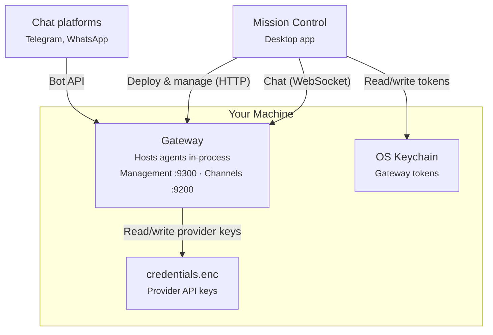

Dash is made up of two main pieces that work together to keep your agent team running.

## System overview



Dash has two main components:

- **Gateway** — Single long-running process that hosts all agents in memory, serves a WebSocket channel server at port 9200, exposes an HTTP management API at port 9300, and connects to external messaging platforms. Mission Control spawns it automatically on first launch and reuses it across MC restarts — the bearer token lives in the OS keychain, so a relaunched MC recognizes its own gateway without a fresh spawn.
- **Mission Control** — Electron desktop app. Main process hosts the supervisor that manages the gateway lifecycle, renderer is a React + Vite UI talking to the main process over IPC.

### Deployment options

Dash is flexible about where each piece runs.

**Single machine** — run everything locally. Launch Mission Control, which spawns the gateway as a child process. Good for development and personal use.

**Headless** — run the gateway standalone on a VPS, server, or in Docker: `npm run gateway`. Manage it through its [Management API](/api-reference), or point Mission Control at the management URL for remote management.

## How your team is organized

<AccordionGroup>
  <Accordion title="LLM layer" icon="microchip">
    Abstraction over LLM provider APIs. Supports Anthropic (Claude), OpenAI (GPT), and Google (Gemini). Handles streaming responses, extended thinking blocks, and tool use blocks. Models use `provider/model` format (e.g. `anthropic/claude-sonnet-4-20250514`, `openai/gpt-4o`, `google/gemini-2.0-flash`) for automatic provider routing.
  </Accordion>
  <Accordion title="Agent" icon="robot">
    The core runtime. An agent manages conversations: it loads session history, sends messages to the LLM, executes tools when the model requests them, and persists everything to disk. Agents loop automatically — if the model asks to run a tool, the agent executes it and sends the result back until the model produces a final response (up to 25 rounds).
  </Accordion>
  <Accordion title="Channel server" icon="comments">
    WebSocket server (port 9200) for real-time agent interaction. Clients connect, send messages, and receive a stream of events (text deltas, tool executions, final responses) as they happen. Supports multiple concurrent conversations on a single connection via message ID correlation.
  </Accordion>
  <Accordion title="Management API" icon="tower-control">
    HTTP server (port 9300) for operational control. Provides health checks (`/health`) plus CRUD for agents, channels, credentials, and models. Used by Mission Control to deploy and manage agents. See the [Management API reference](/api-reference).
  </Accordion>
  <Accordion title="Gateway" icon="server">
    The main entry point. A single process that hosts agents in memory, runs both the channel server and management API, and owns all messaging platform connections. Creates agents with their assigned models and tools, and routes messages from external platforms (Telegram, WhatsApp) to agents. Agents, channels, and credentials are created at runtime through the management API rather than a config file. Supports CLI flags (`--token`, `--data-dir`, …) for standalone use — see [Configuration](/configuration#running-the-gateway-standalone).
  </Accordion>
  <Accordion title="Mission Control" icon="grid-2">
    Desktop app (Electron) for managing the gateway and agents. Spawns the gateway on first launch, stores the management token in the OS keychain, and communicates with the gateway over HTTP (management) and WebSocket (chat). Includes a tabbed chat interface, shared conversation history, an agent deployment wizard, and connector management. Provider API keys are stored in an AES-256-GCM encrypted file (`credentials.enc`).
  </Accordion>
</AccordionGroup>

## Conversation history across devices

Dash for iOS and capability-aware Mission Control share one view. They render the same
gateway-authoritative conversation history. Android remains a legacy, non-resumable client in
this release, so its private chat sessions are not part of that shared history, and the
[sub-agent](#sub-agents) interface — rows, transcripts, and the tasks list — is on iOS, the web
client, and Mission Control only.

For gateways that advertise `conversation-sync-v1`, the gateway owns conversation metadata,
messages, revisions, active turns, and replay sequences. Mission Control keeps a
gateway-identity-scoped read cache so history remains visible offline, but it never treats that
cache as writable truth. A disconnected resumable chat socket detaches only that viewer; the
gateway turn continues until it completes or a client sends an explicit cancel.

Mission Control preserves its older local JSON/JSONL conversations separately. With a capable
gateway they appear as read-only **On this Mac** history. With a gateway that explicitly lacks
the capability, Mission Control keeps the original local-authoritative chat behavior.

## Gateway APIs

The gateway runs two loopback servers for host administration and a separate pinned-TLS listener
for native devices:

| Server | Protocol | Default port | Auth | Purpose |
|--------|----------|-------------|------|---------|
| Management API | HTTP | 9300 | Bearer token | Health, identity, agents, conversation sync, credentials, and models |
| Channel server | WebSocket | 9200 | Query param (`?token=`) | Real-time agent chat and turn resume |
| Mobile LAN server | HTTPS / WSS | 9400 | Phone-scoped bearer | `/mobile/v1` and `/ws/chat` only |

The management and channel servers bind to `127.0.0.1`. The LAN listener binds separately and
exposes only the native-client routes; administrative paths such as credentials, plugins, and
shutdown are not mounted there. Its configured port defaults to `9400`. A pairing QR carries that
exact port, the LAN listener's exact certificate fingerprint, and one phone-scoped capability,
never the administrative bearer. Native clients pin that certificate and send the capability in
the encrypted `Authorization` header for both `/mobile/v1` HTTP/SSE requests and `/ws/chat`
streaming. Clients check `GET /mobile/v1/health` before enabling conversation sync or resumable
chat.

## Remote access identity

When you use the [hosted relay](/remote-access) to reach your agents from your phone,
the gateway authenticates itself with its **own cryptographic identity** rather than a
shared password. On first start, the gateway generates an Ed25519 key pair and stores
the private half on its own disk (owner-readable only); the private key never leaves the
machine. Only the matching **public** key is ever registered with Dash, so the hosted
service holds nothing that could impersonate your gateway.

Gateways are owned by an **organization**, not by an individual login. When you set up
remote access you sign in to Dash and act on behalf of an organization; the gateways and
addresses you create belong to it, which is what lets you share access with teammates. The
hosted service only ever sees the organization a request belongs to — never a password.

Each gateway also has a **permanent address** on the relay — the hostname you chose when
you set up remote access. That address is globally unique and is claimed for good: it's
never reassigned and never recycled, even if you later remove the gateway, so a paired
phone always resolves the same gateway and a name can't be taken over by someone else.

Each time the gateway dials out to the relay, it presents its relay address token
together with a short-lived proof signed by that private key. The relay checks, offline,
that the token was issued by Dash for that exact address **and** that the dialer actually
holds the matching private key (holder-of-key) before it admits the connection. A token
copied from disk or seen on the wire is therefore inert on its own — without the private
key it produces no valid proof.

This also makes remote access self-healing. Relay address tokens are short-lived, and the
gateway renews its own token in the background — on a timer before it expires, on the next
dial after a rejected one, and on boot after being offline. So a gateway that's been
powered off for days or weeks reconnects on its own, with no re-enrollment and without
Mission Control needing to be open.

## Message flow

Here's what happens when a capable client sends a resumable message to one of your agents.

<Steps>
  <Step title="Discover and load">
    The client reads `GET /mobile/v1/health`, confirms `conversation-sync-v1` and
    `chat-resume-v1`, then creates or loads the gateway's canonical conversation.
  </Step>
  <Step title="Connect and send">
    Mission Control opens the loopback channel socket. A paired phone opens the pinned-TLS
    `wss://host:<paired-port>/ws/chat` mobile socket (`9400` by default). The client sends one
    `message` frame with a stable turn ID, the conversation ID, and `resumable: true`.
  </Step>
  <Step title="Accept atomically">
    In one SQLite transaction, the gateway verifies that the conversation is writable, acquires
    its active-turn lease, creates the user and assistant messages, and appends the first durable
    sequence. It then returns `accepted` with those IDs and that sequence.
  </Step>
  <Step title="Process at the gateway">
    The gateway owns the provider run. The agent loads its provider session, calls the LLM, and
    executes requested tools for up to 25 rounds.
  </Step>
  <Step title="Persist, then broadcast">
    Each text delta, tool event, question, and terminal is assigned the next conversation-global
    sequence and committed before the gateway broadcasts it to attached clients.
  </Step>
  <Step title="Detach or finish">
    Losing a socket only detaches that resumable subscriber. A client can replay missed sequences
    and resume the same turn. A terminal `done` or `error` releases the lease; an explicit `cancel`
    stops the provider run and records a cancelled terminal.
  </Step>
</Steps>

Mission Control and the Dash phone app see the same active turn when they use the same capable
gateway. Either client can watch replayed output, answer a pending question, or explicitly cancel
the turn. Closing one client does not cancel shared work.

## WebSocket protocol

**Client → Server:**

| Type | Fields | Description |
|------|--------|-------------|
| `message` | `id`, `agentId`, `channelId`, `conversationId`, `text`, `resumable` | Start a turn; set `resumable` to `true` only when the capability is advertised |
| `resume` | `id`, `agentId`, `conversationId`, `sinceSeq` | Replay missed frames and attach to the same live turn |
| `answer` | `id`, `questionId`, `answer` | Answer a question from the active turn |
| `cancel` | `id` | Explicitly cancel the identified turn |

**Server → Client:**

| Type | Fields | Description |
|------|--------|-------------|
| `accepted` | `id`, `conversationId`, message IDs, `revision`, `seq` | The resumable turn and its two message records are durable |
| `event` | `id`, `conversationId`, `seq`, `event` | A durable streaming event such as text, tool use, or a question |
| `done` | `id`, `conversationId`, `seq`, `outcome` | Durable completion or cancellation |
| `error` | `id`, `conversationId`, `seq`, `error`, `code`, `retryable` | Durable failure, or a structured rejection before a turn starts |

The `id` is the turn ID and correlates all frames for that turn. A conversation has at most one
active turn across every device and socket. Retrying the same accepted turn ID is idempotent;
starting a different turn while the lease is held returns `conversation_busy` and its
`activeTurnId`.

Messages without `resumable: true` retain the legacy connection-owned behavior: their events are
not part of the canonical mobile turn contract, and closing their socket cancels their work.

See the [API reference](/api-reference) for complete payload fields and structured error shapes.

## Conversation and provider session persistence

The canonical conversation record is what Mission Control and paired phone apps render. It owns
the shared title, agent-name snapshot, messages, status, revision, and active turn.

Separately, the agent runtime stores provider session state as append-only JSONL files (one JSON
object per line), under a directory keyed by agent and conversation:

```
~/.dash/gateway/sessions/{agent-name}/{conversationId}/
```

The agent replays these entries to reconstruct the model and tool context it needs for the next
provider call. These provider session files are distinct from the canonical rendered conversation
history shared by Mission Control and mobile clients.

Cross-device conversation state is canonical in the gateway's SQLite database:

```
<gateway-data-dir>/agent-stream-events.db
```

That database owns conversation summaries and revisions, user and assistant messages, deletion
tombstones, the active-turn lease, and the ordered replay journal. Dash mobile and capability-aware
Mission Control clients cache this state and reconcile from the Management API rather than treating
local chat history as authoritative. When the gateway does not advertise the required capabilities,
Mission Control falls back to legacy connection-owned chat.

### Canonical turn durability

Turn acceptance uses one transaction so the lease, both message records, and `accepted` replay
entry either become visible together or not at all. Every later event is also persisted before it
is sent. A client that receives sequence 12 can therefore rely on sequence 12 being replayable,
even if its socket drops immediately afterward.

The provider run belongs to the gateway, not to a WebSocket. Any number of clients may detach and
resume the owning turn, but they all observe the same global lease and sequence. Explicit cancel
is the operation that stops work; a network interruption is not.

On startup, the gateway recovers any conversation left `running` by a process interruption. It
records an interrupted terminal when one is missing, marks the assistant message and conversation
`interrupted`, and releases the stale lease. Clients can replay that terminal before deciding
whether to start a new turn.

## Event log and chat replay

The gateway assigns a monotonically increasing sequence across all turns in a conversation. A
client stores the highest sequence it has applied, then requests entries after that value from
`GET /mobile/v1/agents/:agentId/conversations/:conversationId/events?sinceSeq=...`. Entries arrive
in ascending order and can be applied exactly once by sequence.

If the owning turn is still live, the client sends `resume` with the same turn ID and `sinceSeq`.
The gateway replays the durable gap and attaches the socket for future frames without asking the
LLM to process the prompt again. Conversation change events over the mobile SSE endpoint tell
clients when to refresh summaries; they do not replace replay for chat content.

## Sub-agents

Any agent can hand a self-contained task to a **sub-agent**: a child agent that runs on the same workspace, in its own context, from a prompt that stands alone. The parent either waits for the child's report inside its own turn (foreground) or lets it run detached (background) and is told when it finishes. The tools are [`agent` and `send_message`](/tools#sub-agents); the older `spawn_worker` family are wrappers over the same path.

**A sub-agent is a conversation.** Each child gets a conversation of its own — kind `subagent`, with a link to the parent conversation and the turn that started it, its own messages, its own status, and its own session directory. That is what makes everything else work: its transcript can be replayed and subscribed to like any other, it is addressable by id over HTTP, it can be resumed after it has finished, and it **survives a gateway restart** rather than disappearing with the process that created it. Child conversations are hidden from the ordinary conversation list — you reach them through their parent — and they sit behind the same gateway credentials as every other conversation. There is no per-child access rule: a caller holding those credentials can read any conversation on the gateway, sub-agent or not.

**Foreground or detached.** A foreground child belongs to the parent's turn: cancelling the turn cancels it. A background child outlives the turn, stays addressable by name, and reports back on its own. Either way the child is bounded by its own wall clock (`maxRunSeconds`), and cancelling a child (or deleting the conversation it belongs to) stops everything it started.

**Data flow.**

<Steps>
  <Step title="The parent launches children">
    The `agent` tool resolves the requested type to a definition, intersects its tool list with the parent's own, resolves the model, and asks the coordinator for a child. Per-agent and global caps are enforced before anything starts. Several `agent` calls in one turn run concurrently.
  </Step>
  <Step title="Children run in parallel">
    Each child is its own agent backend on the shared workspace — or on its own git worktree, with `isolation: worktree`. It works from its prompt and can call `ask_orchestrator` to pause and ask a blocking question.
  </Step>
  <Step title="Three events ride the parent's stream">
    The parent's own event stream carries `subagent_started`, `subagent_progress`, and `subagent_finished` for each child — self-describing events (type, name, description, status, report, usage) which is what lets a client draw one card per child, live and identically when replayed from history. The child's own text and tool events do **not** ride the parent's stream; they stay in the child's conversation.
  </Step>
  <Step title="Clients open the child on demand">
    Expanding a child's row fetches that child's conversation over REST and, while it is live, subscribes to it so its transcript streams in place. Nothing is mirrored ahead of time.
  </Step>
  <Step title="The report comes back">
    A foreground child's report is the `agent` tool's result, inside the parent's turn. A background child's completion is queued as a **notification** instead.
  </Step>
</Steps>

**Notification turns.** When a background child finishes — or a resumed one, or one that was sent a message — the gateway records a pending notification and then starts a **system-initiated turn** on the parent conversation carrying it. The parent reads it as a `<task-notification>` block explicitly marked as an automated event rather than user input, and answers in a normal assistant turn that streams and persists like any other. If the parent is busy, the notification waits and is delivered when its current turn finishes; everything pending rides one turn, in order. Clients render the notification message as a compact system row, not a user bubble. A child's report is scanned for instruction-shaped text before it reaches the parent; messages going the other way are not.

**Sub-agents over HTTP.** Three operations are available per conversation, on the loopback API and on `/mobile/v1`: `GET /conversations/:id/subagents` lists a conversation's sub-agents with their status and report, `POST /subagents/:id/stop` cancels one and everything it started, and `POST /subagents/:id/resume` sends it a message — resuming it if it has already finished. A sub-agent's transcript is a conversation of its own, so `GET /conversations/:id/messages` works on a sub-agent id too. Mission Control's **Sub-agents** panel, the web tasks panel, and the iOS tasks sheet are all built on these three.

**After a restart.** A gateway that is killed mid-run marks every sub-agent that was running as **interrupted** on the next start, keeps the transcript, and queues a notification for each parent — delivered as soon as the gateway is serving again, or with the parent's next turn if it is busy. An interrupted sub-agent can be resumed — with `POST /subagents/:id/resume`, or by the parent agent itself — and picks up where it left off. Any leftover worktrees from sub-agents that were running are cleaned up at the same time, except ones holding work: uncommitted changes, untracked files, or commits no branch would keep alive.
