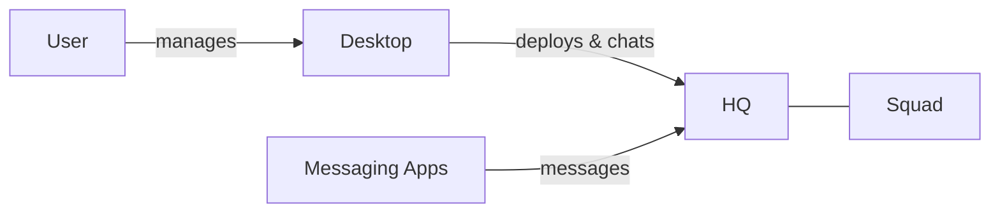

<Warning>
  **Early Access** — Dash is under active development. Expect rough edges and breaking changes.
</Warning>

## The Big Picture

You define AI squad members, deploy them through Desktop, optionally connect them to messaging apps like Telegram, and interact with them through chat. Squad members run autonomously — thinking, using tools, and responding to messages. The whole system runs on your machine, and you stay in control of every piece.

## Squad

A squad member is an AI model paired with a system prompt, tools, and skills. Squad members run autonomously: they receive messages, reason about them, use tools to take action, and respond. Each squad member is configured independently — different models, different tools, different instructions. Squad members persist conversations as sessions so they maintain context across messages.

[Learn more about the Squad](/agents)

## Desktop

Desktop is your command center for the entire system. It's a desktop app that spawns a background HQ process and gives you a UI to deploy squad members, chat with them, monitor activity, and connect messaging platforms. Desktop is also available as a CLI for terminal users and automation.

[Learn more about Desktop](/mission-control)

## AI Providers

Squad members need an AI model to think — you bring your own API key. Dash supports Anthropic (Claude), OpenAI (GPT), and Google (Gemini). Each squad member can use a different provider, and you can set fallback models in case one is unavailable.

[Learn more about AI Providers](/ai-providers)

## Deploying a Squad Member

When you deploy a squad member through Desktop, the HQ creates it in-process with its own workspace. You can start, stop, restart, and remove deployments at any time. Configuration changes — model, tools, system prompt — can be made on the fly.

[Deploy Your First Squad Member](/deploy-your-first-agent)

## Messaging Apps

Connect your squad members to external chat platforms like Telegram and WhatsApp. The HQ sits between messaging platforms and your squad members, routing conversations based on rules you define. One squad member can serve multiple messaging apps, and one app can route to different squad members.

[Learn more about Messaging Apps](/messaging-apps)

## Skills

Skills are reusable instruction sets that extend what a squad member knows how to do. Squad members discover skills automatically from local directories or remote URLs, and load them on demand. You can create custom skills through Desktop or let squad members create their own.

[Learn more about Skills](/skills)

## Tools

Tools are capabilities squad members use to interact with the outside world — run shell commands, read files, edit code, search directories. Each tool is sandboxed to the squad member's workspace directory for safety. You choose which tools each squad member has access to in its configuration.

[Learn more about Tools](/tools)

## Secrets & Security

API keys and sensitive credentials are encrypted at rest using AES-256-GCM. The encryption key is derived from a password you set and cached in your OS keychain. HQ management tokens also live in the OS keychain, never in plaintext files. Squad members run in sandboxed workspace directories, and your data never leaves your machine except to your chosen AI provider.

[Learn more about Secrets](/secrets)

## Chat

Talk to your squad members through Desktop's built-in tabbed chat, through connected messaging apps like Telegram, or programmatically via the WebSocket API. Messages stream in real time — you see the squad member thinking, using tools, and building its response as it goes. Conversations persist as sessions, so squad members remember previous context.

[Chat with Your Squad Member](/chat-with-your-agent)

## What's Next

<CardGroup cols={3}>
  <Card title="Get started" icon="rocket" href="/getting-started">
    Install Dash and launch your first agent.
  </Card>
  <Card title="Deploy an agent" icon="play" href="/deploy-your-first-agent">
    Step-by-step guide to deploying through Desktop.
  </Card>
  <Card title="Example agents" icon="book" href="/example-agents">
    Ready-made configurations to get you started.
  </Card>
</CardGroup>
