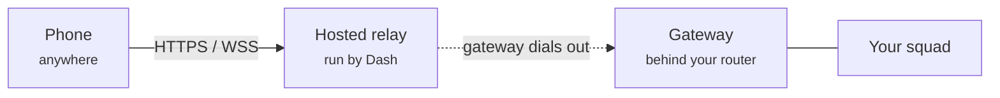

Dash for Android connects to your gateway over your local Wi-Fi by default, and can also pair
through the **hosted relay** to reach the same agents from anywhere — on cellular, at the office,
travelling — without opening any ports on your home network.

Dash for iOS always connects through the hosted relay: sign in with your Dash account and pick
your gateway from the list — no local network or QR code involved.

<Note>
The hosted relay is run by Dash. You sign in to your Dash account, create a
gateway, then connect your phone or tablet — there's no server to set up and no domain
to buy. Traffic is encrypted with TLS from your device to the hosted relay and again from
the relay to your gateway. The relay terminates those connections to route requests,
so treat the Dash-hosted relay as a trusted service: it can process request headers
and bodies while forwarding them. Neither Android's QR pairing nor iOS's account sign-in
ever gives a device the gateway's administrative token; each gets a phone-scoped capability
and a revocable device credential instead.
</Note>

## When you need it

<CardGroup cols={2}>
  <Card title="Use the relay" icon="globe">
    You want to chat with your agents from your phone while away from home, where
    your phone and the gateway are on different networks. Dash for iOS always uses this path.
  </Card>
  <Card title="Skip the relay" icon="wifi">
    Your Android phone and the machine running Dash are on the same Wi-Fi. Just pair over
    the local network — no relay needed.
  </Card>
</CardGroup>

## How it works

The relay is a **reverse tunnel**. Your gateway dials *out* to the relay (outbound
connections pass through home routers and firewalls), and the relay forwards your
phone's requests back down that connection.

TLS protects both network legs, while the hosted relay terminates each leg so it can
route HTTP and WebSocket traffic. Your Dash sign-in identifies you, each gateway gets
its own address, and every device you connect — Android by pairing, iOS by signing in —
carries its own revocable credential. The gateway still enforces one phone-scoped
capability for both the mobile API and chat; the administrative bearer remains on the
gateway machine.

## Set it up

<Steps>
  <Step title="Sign in to Dash">
    In Mission Control, open **Settings → Devices → Remote access** and click **Sign in to
    Dash**. Your browser opens to the Dash sign-in page. Sign in, and the browser
    hands you back to Mission Control automatically. You only do this once per
    machine.

    Your gateways belong to an **organization** rather than to you personally, so
    you can later share access with teammates. If the sign-in page asks you to
    create or pick an organization, choose one — the gateways you create are owned
    by whichever organization you're signed in to.
  </Step>
  <Step title="Choose your gateway's address">
    Click **Create gateway** and pick a name for your gateway's address — something
    short and memorable that you'll recognise (for example, your initials or your
    machine's name; any name shown here is just an example). As you type, Dash checks
    whether the name is free. The name becomes your gateway's permanent address on the
    relay (`<your-name>.<the relay domain>`). Confirm, and Dash claims the address and
    restarts the gateway so it connects out. When it's ready you'll see **Gateway ready
    at** followed by your address.
  </Step>
  <Step title="Connect your phone or tablet">
    **Android:** open **Settings → Devices**. With a gateway created, the QR code in the
    **Pair Device** section now carries your relay address and a per-device credential.
    Scan it with the Dash Android app — it connects through the relay from then on,
    wherever you are.

    **iOS:** open Dash on your iPhone or iPad and tap **Sign In**. Sign in with the same
    Dash account, then tap your gateway in the list — see [Dash for iPhone and
    iPad](/ios#sign-in) for the full flow. There's no QR code to scan.
  </Step>
</Steps>

Dash for iOS and Mission Control share the gateway-authoritative conversation history, including
running turns, replay, renames, and deletions. Android remains a legacy, non-resumable client in
this release: its chat sessions stay private to that app until the separate Android conversation
sync migration. Both apps get a phone-scoped capability and a revocable device credential, whether
by QR pairing (Android) or account sign-in (iOS).

<Note>
Your gateway's address is **permanent**. Once you claim a name it belongs to this
gateway for good — it's never reassigned to anyone else, and it isn't released even if
you later remove the gateway. Choose a name you're happy to keep. This is what lets your
paired phones keep finding your gateway over time.
</Note>

<Tip>
Every phone you pair gets its own credential, so you can pair as many devices as
you like and manage them one at a time.
</Tip>

## Manage your devices

Back on **Settings → Devices**, under **Remote access**, the **Paired devices** list shows every
phone or tablet connected to your gateway, including any signed-in iPhone or iPad. To disconnect
one — a device you've lost, sold, or no longer use — click **Revoke** next to it. That device can
no longer reach your agents through the relay; your other devices keep working untouched.

<Tip>
A revoked device just needs to reconnect to come back, and gets a new credential either way. On
Android, open **Settings → Devices** and scan a fresh **Pair Device** QR code. On iOS, open
**Settings** on the phone and choose **Disconnect & Forget**, then sign back in and tap the
gateway again in the picker — no QR code needed.
</Tip>

## Signing out

Signing out of Dash on this machine stops new gateways and pairings from being
created here. Your gateway keeps its stable address, so signing back in later picks
up right where you left off.
